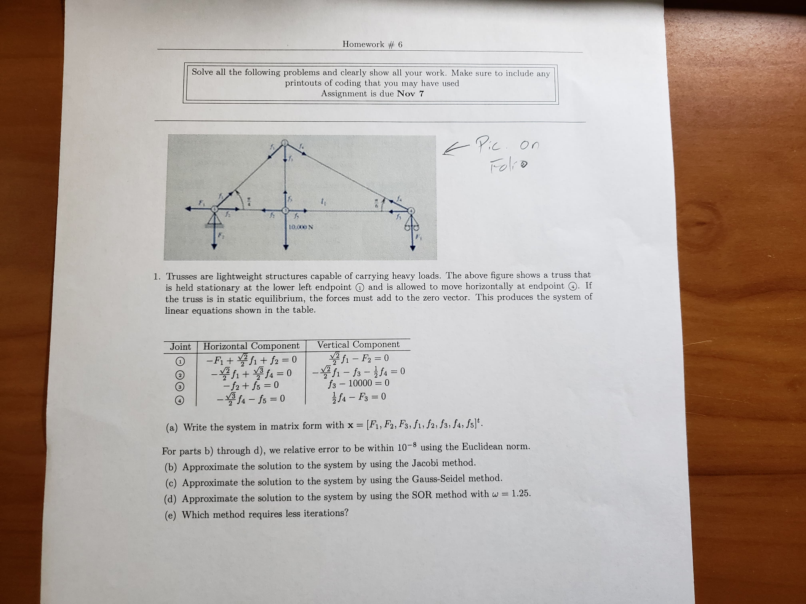

# Comparing 5 Matrix Iteration Methods
### Iteration Methods
1. [Jacobi Method](https://en.wikipedia.org/wiki/Jacobi_method)
2. [Gauss-Seidel Method](https://en.wikipedia.org/wiki/Gauss%E2%80%93Seidel_method)
3. [SOR (Successive Over Relaxation)](https://en.wikipedia.org/wiki/Successive_over-relaxation) Method
4. [Steepest Descent (Gradient Descent)](https://en.wikipedia.org/wiki/Gradient_descent)
5. [Conjugate Gradient Method](https://en.wikipedia.org/wiki/Conjugate_gradient_method)

The code for each method can be found in [iterative_methods.py](iterative_methods.py). 
Each function has two modes of operation that are determined by the parameters passed into the function. 

**Passing in:**
 1. `n`: Performs a fixed number of n iterations of the method
 2. `delta` and `actual`: Performs up to `max_iterations` (set in [iterative_methods.py](iterative_methods.py) or passed as a parameter) until the relative error between the actual solution norm and the calculated solution norm is less than `delta`.    
 
 
## main.py
[main.py](main.py) solves an 8x8 matrix using 5 different iteration methods, and comparing the iterations taken for each method.
The 8x8 matrix is generated by the following assignment description:
